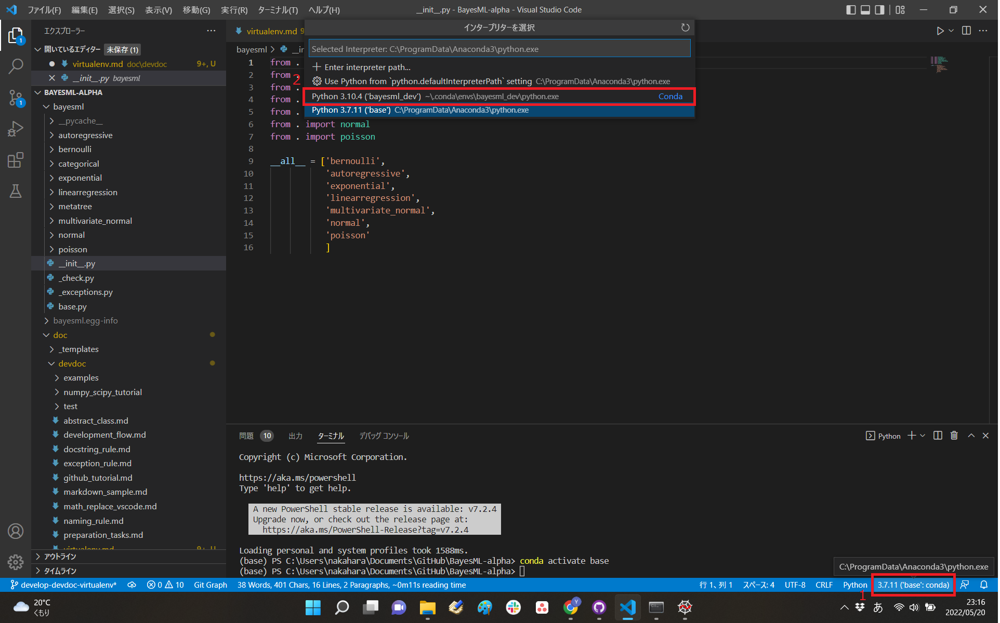

# BayesML開発用仮想環境の構築法

<div style="text-align:right">
作成：中原
</div>

以下はあくまで暫定的な環境構築法である．Pythonにおける仮想環境の構築法としてはconda以外にもpyenv, venvなどがある．しかし，venvはOSによって操作方法が異なるなどの問題がある．そこで，ここではcondaによる仮想環境構築法を利用する．condaとpipを同時に使わなければならない（なるべくなら同時に使うべきではない）というのが懸念事項であるが，問題が起きるまでは以下のフローで進めようと思う．

## 環境構築時

1. 仮想環境の構築
   1. Anaconda promptを起動し，以下を入力する．
        ```
        conda create -n bayesml_dev python
        conda activate bayesml_dev
        ```
        1行目で仮想環境を作成し，2行目でその仮想環境を起動している．この時点でpython以外のインストールを行う必要はない．``bayesml_dev``というのは単なる環境名なので，好きに変更して良い．
2. ディレクトリの移動
   1. Anaconda prompt上で``cd``コマンドを使い，BayesMLフォルダ，またはBayesML-alphaフォルダに移動する
3. pipによるローカルからのインストール
   1. 以下を入力する
        ```
        pip install -e .
        ```
        ``.``によってカレントディレクトリのsetup.pyに従ってパッケージがインストールされる．``-e``は編集モードを意味するオプションでパッケージへの変更が即時反映される．numpyなどの依存パッケージはこの段階で自動的にインストールされる．

## 開発時

開発環境によって操作は異なるが，とにかく先ほど作成した仮想環境を起動してから開発を行う．VS Codeなら以下の画像の右下，中央上の順にクリックすると仮想環境を起動できる．



Spyderを利用する場合にはそもそもSpyderを仮想環境にインストールする必要がある．その後，Anaconda prompt上で仮想環境の起動を行ってから，Anaconda prompt上にspyderと入力することによってSpyderを起動すればよい．

BayesMLのインストールが済んでいるので，モジュールの``import``時に``sys.path.insert(0, os.path.abspath('..'))``などを追記する必要はない．単に``import bayesml.bernoulli``などと書けばよくなる．``-e``オプションでインストールしているため，bayesml上の変更は即時反映される．
